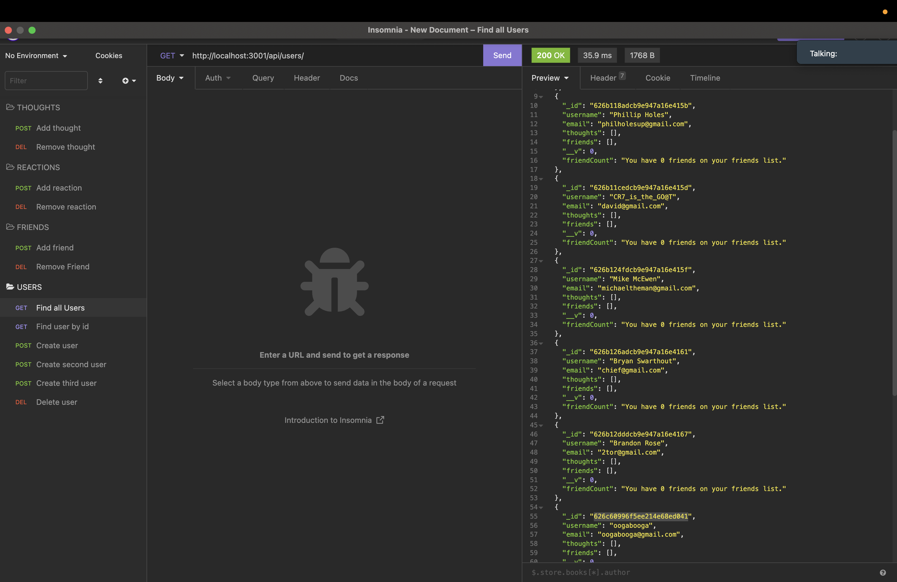

# That-One-Movie-About-Facebook

## Description

This project is a back-end database for a social media platform created through Mongoose and MongoDb. This application can be used to store, add, receive, and delete information in the social network database.

## Table of Contents

- [Usage](#usage)

- [Contributing](#contributing)

- [Tests](#tests)

- [Github](#github)

- [Links](#links)

## "Ey Big Girl, Make em' Back It Up" - V.I.C.

This application requires a mySql databse to be created, along with the "npm run seed" command before starting up the server. This project was definitely more tedious because of all the connections each data set had with them. Also a lot of debugging was necessary before all the typos were shored-up

## Contributing

Me, professors, and Brandon Rose

## Github

    Github username: SeanLee-17

## Links

- [Github](https://github.com/SeanLee-17/That-One-Movie-About-Facebook)

## Screenshot

